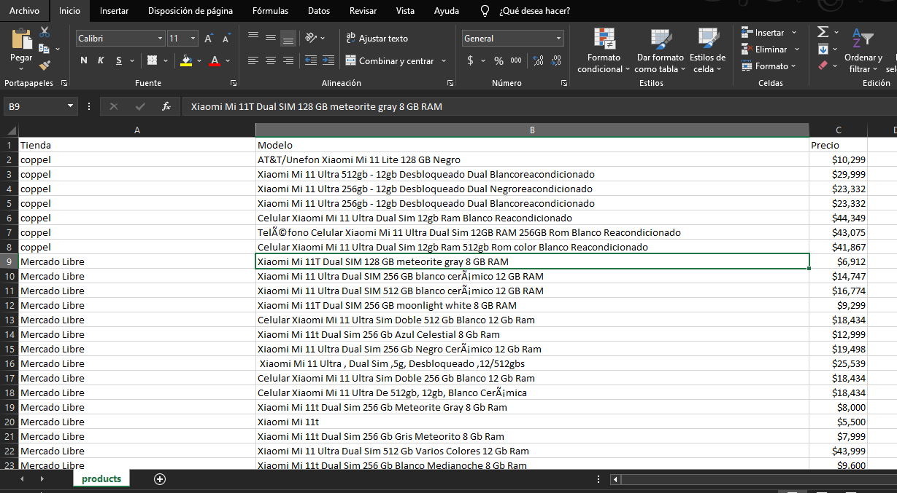

# webScrapping-bigdata-unach
Participé en un proyecto de web scraping enfocado en la extracción y recopilación de datos de diferentes fuentes en línea. Utilizando técnicas de automatización y programación, desarrollamos un sistema capaz de extraer información relevante de sitios web específicos.

## Aqui se muestra los datos obtenidos

